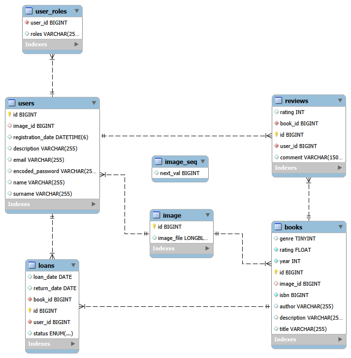
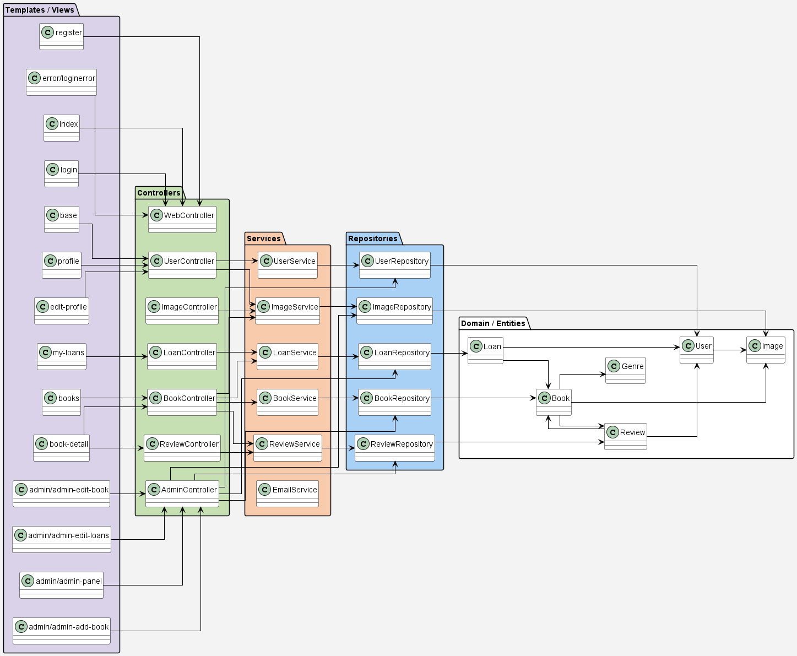
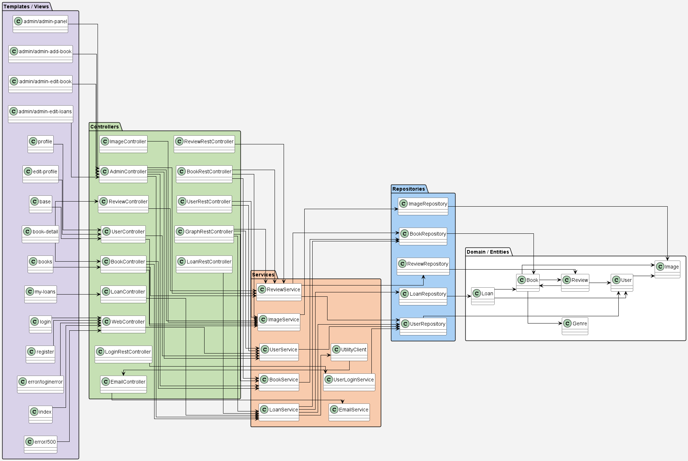
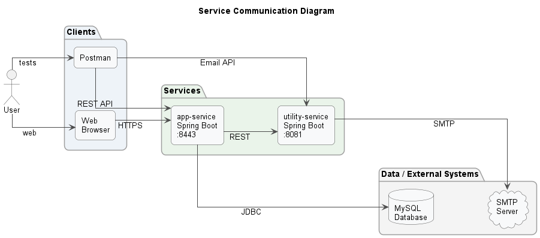

# [BiblioOnline]

## 👥 Miembros del Equipo
| Nombre y Apellidos | Correo URJC | Usuario GitHub |
|:--- |:--- |:--- |
| Álvaro Bravo Pareja     | a.bravop.2023@alumnos.urjc.es  | AlvaroBravoPareja      |
| Carlos Asensio Trujillo | c.asensio.2023@alumnos.urjc.es | c-asensio              |
| Ángel Vila Sanchez      | a.vilas.2019@alumnos.urjc.es   | vilasanchezangel-codes |


---

## 🎭 **Preparación: Definición del Proyecto**

### **Theme description**
This project is a digital library management platform within the education and culture sector. The application allows users to explore a comprehensive book catalog, manage loans with automated due dates, and share their reading experiences through a review system.

Value Proposition:

- Centralization: Provides easy and organized access to the library's book inventory.

- Interactivity: Enables readers to actively participate in the community through a rating and commenting system.

- Efficient Management: Ensures rigorous control over loan periods, managing return deadlines and user history.


### **Entities**

1. **[Entity 1]**: [User]
2. **[Entity 2]**: [Book]
3. **[Entity 3]**: [Loan]
4. **[Entity 4]**: [Review]

**Relationships between entities:**
- [User - Loan: A user can have multiple loans over time, but each loan record belongs to a single specific user (1:N)]
- [Book - Loan: A book can be associated with multiple loan records (history), although it is typically linked to one active loan at a time (1:N)]
- [User - Review: A user can write multiple reviews for different books they have read (1:N)]
- [Book - Review: A book can receive multiple reviews and ratings from different users to calculate its average reputation (1:N)]

### **User Permissions**

* **Anonymous User**: 
  - Permissions: [Browse the book catalog, use the search functionality, register for a new account, log in]
  - This user does not own any entities.

* **Registered User**: 
  - Permissions: [Manage their personal profile (including uploading an avatar), request book loans, view their loan history, post reviews for books they have borrowed]
  - Is owner of: [Their own User profile, their Loan records, and their submitted Reviews]

* **Administrator**: 
  - Permissions: [(Create, Read, Update, Delete) operations on the Book catalog, monitoring all Loans, moderating Reviews, and managing User accounts]
  - Is owner of: [All Book entities; has administrative authority over all Loans, Reviews, and Users]

### **Images**

- **[Entity with images 1]**: [User - One image as a profile avatar per user]
- **[Entity with images 2]**: [Book - A representative image of the book cover]

### **Graphics**

- **Graphic 1**: [Most Popular Genres – A pie chart representing the most borrowed genres]
- **Gráfico 2**: [Most Rated Genres – A bar chart displaying the mean of rated reviews for each genre (from 1 to 5 stars)]

### **Complementary Technology**

- [Automatic mail sender using JavaMailSender with information about a loan made by a user]

### **Advanced Algorithm or Query**

- **Algorithm/Query**: [Personalized Book Recommendation System based on User Loan History.]
- **Description**: [The algorithm analyzes the genres of books previously borrowed by the user to identify their reading preferences. It then processes the library catalog to suggest the best rated available titles that match those specific categories]
- **Alternative**: [A query that identifies "Trending Books" by calculating which titles have the highest turnover rate and best ratings within the last 30 days, filtered by the user's favorite genre]

---

## 🛠 **Práctica 1: Maquetación de páginas web con HTML y CSS**

### **Navigation diagram**
Diagram that shows how to navigate between the different pages of the application:

/Diagram-images/NavigationDiagram.png)

> Anonimous users can see the most rated books in their home page and also can see the book catalog page.
   The registered users have a different home page where, apart from having a different subheader, they have recomendations based on their previous loans. If a user is registered, the header shows a dropdown menu where you can see your profile, your loans and the option to logout. Finally, administrators can access the admin panel

### **Screenshots and page descriptions**

#### **1. Main Page/Index**
/Diagram-images/index.jpeg)

> Main page of the application, from which unregistered users can access the book catalog, register, or log in. It also displays a selection of featured books (the most rated ones).

#### **2. Register**
/Diagram-images/Registro.jpeg)

> Registration form that allows new users to create an account on the platform.

#### **3. Login**
/Diagram-images/Login.jpeg)

> Login form that allows users to access the platform using their email and password.

#### **4. Books**
/Diagram-images/Books.jpeg)

> Page displaying the catalog of available books, allowing users to browse and filter the library collection.

#### **5. Book Details**
/Diagram-images/Book%20details.jpeg)

> Page showing detailed information about a specific book, including the cover, title, author, description, options related to loggued-in users  or admin and viewing/writing reviews.

#### **6. Base**
/Diagram-images/Base.jpeg)

> Base page that acts as the main entry point for authenticated users, providing the general navigation structure after logging in along with book recomendations based on the user previous loans.

#### **7. User Profile**
/Diagram-images/Profile.jpeg)

> User profile page where personal information is displayed and account settings can be managed.

#### **8. Edit User Profile**
/Diagram-images/Edit%20profile.jpeg)

> Page that allows users to edit and update their personal information.

#### **9. My Loans**
/Diagram-images/Loans.jpeg)

> Page that displays the user's loans, including active, overdue, or returned books along with their corresponding dates.

#### **10. AdminPanel**
/Diagram-images/Admin%20panel.jpeg)

> Main administration panel that provides an overview of the system and access to the management of books, loans, reviews, and users. It also shows the graphs.

#### **11. New Book**
/Diagram-images/New%20book.jpeg)

> Administration form used to add a new book to the library catalog.

#### **12. Edit Book**
/Diagram-images/Edit%20book.jpeg)

> Administration form used to modify the information of an existing book in the system.

#### **13. Edit Loan**
/Diagram-images/Edit%20loan.jpeg)

> Administration form used to modify the information of an existing loan (Extend loan period).

### **Member Participation in Practice 1**

#### **Student 1 - Alvaro Bravo Pareja**

| Nº    | Commits      | Files      |
|:------------: |:------------:| :------------:|
|1| [Index page](https://github.com/CodeURJC-SSDD-2025-26/ssdd-2025-26-project-base/commit/5ca695dca9722519bda616b048475a40a19c10ec)  | [index.html](https://github.com/CodeURJC-SSDD-2025-26/practica-ssdd-2025-26-grupo-11/blob/main/Practice1/index.html) / [index.css](https://github.com/CodeURJC-SSDD-2025-26/practica-ssdd-2025-26-grupo-11/blob/main/Practice1/css/index.css)  |
|2| [Base page](https://github.com/CodeURJC-SSDD-2025-26/ssdd-2025-26-project-base/commit/2f8a91bb7fc0ba6f99e2209003820baba0157a51)  | [base.html](https://github.com/CodeURJC-SSDD-2025-26/practica-ssdd-2025-26-grupo-11/blob/main/Practice1/base.html)   |
|3| [Book search page](https://github.com/CodeURJC-SSDD-2025-26/ssdd-2025-26-project-base/commit/a134a0ecedabf2009ed432e08a2db0990acc1895)  | [books.html](https://github.com/CodeURJC-SSDD-2025-26/practica-ssdd-2025-26-grupo-11/blob/main/Practice1/books.html) / [books.css](https://github.com/CodeURJC-SSDD-2025-26/practica-ssdd-2025-26-grupo-11/blob/main/Practice1/css/books.css)  |
|4| [Admin panel](https://github.com/CodeURJC-SSDD-2025-26/ssdd-2025-26-project-base/commit/bc9906b43256ade8bbf8b62eaef649147b498bd1)  | [admin-panel.html](https://github.com/CodeURJC-SSDD-2025-26/practica-ssdd-2025-26-grupo-11/blob/main/Practice1/admin/admin-panel.html) / [admin-panel.css](https://github.com/CodeURJC-SSDD-2025-26/practica-ssdd-2025-26-grupo-11/blob/main/Practice1/css/admin-panel.css)   |
|5| [Modals added](https://github.com/CodeURJC-SSDD-2025-26/ssdd-2025-26-project-base/commit/5fb06ff314d853dd9404824c2befe086242eafe6)  | [book-details.html](https://github.com/CodeURJC-SSDD-2025-26/practica-ssdd-2025-26-grupo-11/blob/main/Practice1/admin/book-details.html)   |

---

#### **Student 2 - Carlos Asensio Trujillo**

| Nº    | Commits      | Files      |
|:------------: |:------------:| :------------:|
|1| [Added MyLoans page and later updated its style to match the admin panel style and fixed issues](https://github.com/CodeURJC-SSDD-2025-26/ssdd-2025-26-project-base/commit/d66a099fc125edc550ba40bc36c103664ce44d55)  | [MyLoans/MyLoans css](https://github.com/CodeURJC-SSDD-2025-26/practica-ssdd-2025-26-grupo-11/blob/main/Practice1/my-loans.css) / [MyLoans](https://github.com/CodeURJC-SSDD-2025-26/practica-ssdd-2025-26-grupo-11/blob/main/Practice1/my-loans.html)  |
|2| [Added Login page](https://github.com/CodeURJC-SSDD-2025-26/ssdd-2025-26-project-base/commit/31e38182331066d548df6b167815f80841fb409c)  | [Login](https://github.com/CodeURJC-SSDD-2025-26/practica-ssdd-2025-26-grupo-11/blob/main/Practice1/login.html)   |
|3| [Added Register page](https://github.com/CodeURJC-SSDD-2025-26/ssdd-2025-26-project-base/commit/31e38182331066d548df6b167815f80841fb409c)  | [Register](https://github.com/CodeURJC-SSDD-2025-26/practica-ssdd-2025-26-grupo-11/blob/main/Practice1/register.html)   |
|4| [Added Admin-Edit-book](https://github.com/CodeURJC-SSDD-2025-26/ssdd-2025-26-project-base/commit/d66a099fc125edc550ba40bc36c103664ce44d55)  | [Admin-Edit-Book](https://github.com/CodeURJC-SSDD-2025-26/practica-ssdd-2025-26-grupo-11/blob/main/Practice1/admin/admin-edit-book.html)   |
|5| [Added Admin-Edit-loan](https://github.com/CodeURJC-SSDD-2025-26/ssdd-2025-26-project-base/commit/d66a099fc125edc550ba40bc36c103664ce44d55)  | [Admin-Edit-Loan](https://github.com/CodeURJC-SSDD-2025-26/practica-ssdd-2025-26-grupo-11/blob/main/Practice1/admin/admin-edit-loans.html)   |
|6| [Completed README and fixed header issues](https://github.com/CodeURJC-SSDD-2025-26/ssdd-2025-26-project-base/commit/c435bade841fd87879a3a8dcd84a3844bf75b0cd)  | [README](https://github.com/CodeURJC-SSDD-2025-26/practica-ssdd-2025-26-grupo-11/edit/main/README.md)   |

---

#### **Student 3 - Ángel Vila Sanchez**

| Nº    | Commits      | Files      |
|:------------: |:------------:| :------------:|
|1| [Book-detail and CSS header-footer](https://github.com/CodeURJC-SSDD-2025-26/practica-ssdd-2025-26-grupo-11/commit/5fb4026f4cc8c2f0fb1617d7cf1c35760899833b)  | [Book-detail](https://github.com/CodeURJC-SSDD-2025-26/practica-ssdd-2025-26-grupo-11/blob/main/Practice1/book-detail.html)   |
|2| [Complete book details, add user profile and global footer fix.](https://github.com/CodeURJC-SSDD-2025-26/practica-ssdd-2025-26-grupo-11/commit/d7dd20264b3e80a73693496420b4ffe5b3d46087)  | [Profile](https://github.com/CodeURJC-SSDD-2025-26/practica-ssdd-2025-26-grupo-11/blob/main/Practice1/profile.html)   |
|3| [Add edit-profile page and update profile navigation](https://github.com/CodeURJC-SSDD-2025-26/practica-ssdd-2025-26-grupo-11/commit/3726ba2b2b6cc872c4987f1f91e5197b7fd46182)  | [edit-profile](https://github.com/CodeURJC-SSDD-2025-26/practica-ssdd-2025-26-grupo-11/blob/main/Practice1/edit-profile.html)   |
|4| [Implement user management by admin and the book creation form](https://github.com/CodeURJC-SSDD-2025-26/practica-ssdd-2025-26-grupo-11/commit/67570d8bb5e01d200be98a3b19eabac9d72b977e)  | [admin-add-book](https://github.com/CodeURJC-SSDD-2025-26/practica-ssdd-2025-26-grupo-11/blob/main/Practice1/admin/admin-add-book.html)   |
|5| [Improve book detail and fix admin navigation](https://github.com/CodeURJC-SSDD-2025-26/practica-ssdd-2025-26-grupo-11/commit/983351fe2e85e4b235e8fd5207d2d6544d491ee2)  | [book-detail](https://github.com/CodeURJC-SSDD-2025-26/practica-ssdd-2025-26-grupo-11/blob/main/Practice1/book-detail.html)   |

---

## 🛠 **Practice 2: Web with Server-Generated HTML**

### **Execution Instructions**

#### **Prerequisites**
- **Java**: version 21 or higher
- **Maven**: version 3.8 or higher
- **MySQL**: version 8.0 or higher
- **Git**: to clone the repository

#### **Steps to run the application**

1. **Clone the repository**
   ```bash
   git clone https://github.com/[user]/CodeURJC-SSDD-2025-26/practica-ssdd-2025-26-grupo-11.git
   cd [name]
   ```

2. **Access to backend folder**
   ```bash
   cd backend
   ```

3. **Install the dependencies**

   ```bash
   mvn clean install
   ```

4. **Run the application**
   ```bash
   mvn spring-boot:run
   ```

5. **Access the local host**

   [https://localhost:8443](https://localhost:8443)

#### **Test credentials**
- **Admin user**: user: `admin@example.com`, password: `adminpass`
- **Registered user**: user: `user@example.com`, password: `pass`

### **Database Entity Diagram**

Diagram showing the entities, their fields, and relationships:



### **Classes and Templates Diagram**

Application Class Diagram with color-coded sections:



### **Member Participation in Practice 2**

#### **Student 1 - Alvaro Bravo Pareja**

| Nº    | Commits      | Files      |
|:------------: |:------------:| :------------:|
|1| [Index and base page](https://github.com/CodeURJC-SSDD-2025-26/practica-ssdd-2025-26-grupo-11/commit/0ad822fa872ce74f155e45b06bfa06369ea10c48)  | [Index.html](/backend/src/main/resources/templates/index.html) / [Base.html](/backend/src/main/resources/templates/base.html) / [BookController.java](/backend/src/main/java/es/codeurjc/practica2/controller/BookController.java) / [BookRepository.java](/backend/src/main/java/es/codeurjc/practica2/repository/BookRepository.java) / [BookService.java](/backend/src/main/java/es/codeurjc/practica2/service/BookService.java)  |
|2| [Login, security and CSRF token](https://github.com/CodeURJC-SSDD-2025-26/practica-ssdd-2025-26-grupo-11/commit/82879e69f5a52f242ba6514d05c5baebd52fccc6)  | [Login.html](/backend/src/main/resources/templates/login.html) / [SecurityConfig.java](/backend/src/main/java/es/codeurjc/practica2/security/SecurityConfig.java) / [CRSFHandlerConfiguration.java](/backend/src/main/java/es/codeurjc/practica2/security/CSRFHandlerConfiguration.java) / [GlobalControllerAdvice.java](/backend/src/main/java/es/codeurjc/practica2/security/GlobalControllerAdvice.java) / [RepositoryUserDetailsService.java](/backend/src/main/java/es/codeurjc/practica2/security/RepositoryUserDetailsService.java) |
|3| [Error pages](https://github.com/CodeURJC-SSDD-2025-26/practica-ssdd-2025-26-grupo-11/commit/996c1cf1a9f509eac9629479c1949afaa83f4631)  | [Error folder](/backend/src/main/resources/templates/error/)   |
|4| [Visual and logic changes](https://github.com/CodeURJC-SSDD-2025-26/practica-ssdd-2025-26-grupo-11/commit/6499cf0f6ae7a8780b1a8eef0fe0c044ae92c758)  | [admin-panel.html](/backend/src/main/resources/templates/admin/admin-panel.html) / [book-detail.html](/backend/src/main/resources/templates/book-detail.html) |
|5| [Ensurance of appropiate project structure and good practices](https://github.com/CodeURJC-SSDD-2025-26/practica-ssdd-2025-26-grupo-11/commit/91e3b6e3161bd6e619277d1e18fcea9266f9d839)  | [All the project structure](/backend/) |

---

#### **Student 2 - Carlos Asensio Trujillo**

| Nº    | Commits      | Files      |
|:------------: |:------------:| :------------:|
|1| [Implement backend integration and security configuration](https://github.com/CodeURJC-SSDD-2025-26/practica-ssdd-2025-26-grupo-11/commit/c156f9f447f98a95fe8e2d25612f2c9962f33233)  | [WebController.java,DataInitializer.java and SecurityConfig.java](https://github.com/CodeURJC-SSDD-2025-26/practica-ssdd-2025-26-grupo-11/commit/c156f9f447f98a95fe8e2d25612f2c9962f33233#diff-01bfd5128549fa76fff392acf037b47ed5af6fcd9a9a99fce9025663a7bd9574)   |
|2| [Implement user registration and login functionality ](https://github.com/CodeURJC-SSDD-2025-26/practica-ssdd-2025-26-grupo-11/commit/ec9ab3419819314afedaf1535f29fa10c9b76646)  | [UserController.java and Login.html Register.html](https://github.com/CodeURJC-SSDD-2025-26/practica-ssdd-2025-26-grupo-11/commit/ec9ab3419819314afedaf1535f29fa10c9b76646#diff-b2469ee29439c23c45f2f41939ce95ae3d142728327838a0f10fb6813e5d4343)   |
|3| [Created admin panel book management with create, edit, delete](https://github.com/CodeURJC-SSDD-2025-26/practica-ssdd-2025-26-grupo-11/commit/c859210e8703983c1954028bbb0324fb334b72f0)  | [admin-panel.html](https://github.com/CodeURJC-SSDD-2025-26/practica-ssdd-2025-26-grupo-11/commit/c859210e8703983c1954028bbb0324fb334b72f0#diff-9fd3698fe0787d892d9fcf342a3b21a8a84d3ff52686af4410fd1d0223585c40)   |
|4| [Admin panel: added loans and reviews funcionality](https://github.com/CodeURJC-SSDD-2025-26/practica-ssdd-2025-26-grupo-11/commit/0d740145119214e710211fd0a20444d7c747cc88)  | [Admin-panel.html](https://github.com/CodeURJC-SSDD-2025-26/practica-ssdd-2025-26-grupo-11/commit/0d740145119214e710211fd0a20444d7c747cc88#diff-9fd3698fe0787d892d9fcf342a3b21a8a84d3ff52686af4410fd1d0223585c40)   |
|5| [Implemented books funcionality and navigation](https://github.com/CodeURJC-SSDD-2025-26/practica-ssdd-2025-26-grupo-11/commit/4f327c6881c8e94df9082f5a1a3529cd91310402)  | [BookController.java y books.html](https://github.com/CodeURJC-SSDD-2025-26/practica-ssdd-2025-26-grupo-11/commit/4f327c6881c8e94df9082f5a1a3529cd91310402#diff-11d79059960a7c96003a89afe8dab6f9d42b0053ea4b0f6455ce3475952b2b61)   |
|6| [Add user profile view and edit functionality](https://github.com/CodeURJC-SSDD-2025-26/practica-ssdd-2025-26-grupo-11/commit/ddd0a5f30a2669f52f1491aa8deca55aa6647e56)  | [BookController.java, Profile.html, Edit-profile.html and book-detail](https://github.com/CodeURJC-SSDD-2025-26/practica-ssdd-2025-26-grupo-11/commit/ddd0a5f30a2669f52f1491aa8deca55aa6647e56#diff-11d79059960a7c96003a89afe8dab6f9d42b0053ea4b0f6455ce3475952b2b61)   |

---

#### **Student 3 - Ángel Vila Sánchez**

| Nº    | Commits      | Files      |
|:------------: |:------------:| :------------:|
|1| [Deletion of users and loans](https://github.com/CodeURJC-SSDD-2025-26/practica-ssdd-2025-26-grupo-11/commit/c727fb520b0a1b69608f5eb95d357816ecb73731)  | [AdminController.java y admin-panel.html](https://github.com/CodeURJC-SSDD-2025-26/practica-ssdd-2025-26-grupo-11/commit/c727fb520b0a1b69608f5eb95d357816ecb73731#diff-b8b02c93fb6286f8a34870f26b78e466b1eb33bacc2f3ba21ec42fee958cc8a4)   |
|2| [Implement dynamic book-details and improve structure of weController](https://github.com/CodeURJC-SSDD-2025-26/practica-ssdd-2025-26-grupo-11/commit/f3f2d8778b8688bf707a36728d83218277c7e340)  | [WebController.java](https://github.com/CodeURJC-SSDD-2025-26/practica-ssdd-2025-26-grupo-11/commit/f3f2d8778b8688bf707a36728d83218277c7e340#diff-01bfd5128549fa76fff392acf037b47ed5af6fcd9a9a99fce9025663a7bd9574)   |
|3| [Implement personalized book recommendations by genre and fix the display of them](https://github.com/CodeURJC-SSDD-2025-26/practica-ssdd-2025-26-grupo-11/commit/d7399e557eef1dbb35133801e6ef1518595c37d6)  | [base.html, UserController.java, BookRepository.java and UserService.java](https://github.com/CodeURJC-SSDD-2025-26/practica-ssdd-2025-26-grupo-11/commit/d7399e557eef1dbb35133801e6ef1518595c37d6#diff-1f0cf94b06c0a3ca32766dbd7d3c6b7dde4c8a5ef1524ed9b3699ed2cd4c5f94)   |
|4| [Create and complete admin panel and smart book recommendations](https://github.com/CodeURJC-SSDD-2025-26/practica-ssdd-2025-26-grupo-11/commit/0167805856fe4665784ea5fc07d48b48443c51a0)  | [AdminPanel.html and AdminController.java](https://github.com/CodeURJC-SSDD-2025-26/practica-ssdd-2025-26-grupo-11/commit/0167805856fe4665784ea5fc07d48b48443c51a0#diff-9fd3698fe0787d892d9fcf342a3b21a8a84d3ff52686af4410fd1d0223585c40)   |
|5| [Automatic email](https://github.com/CodeURJC-SSDD-2025-26/practica-ssdd-2025-26-grupo-11/commit/01e592eb499a4581b426aefcc88b6d1456b9ea85)  | [emailService.java +4](https://github.com/CodeURJC-SSDD-2025-26/practica-ssdd-2025-26-grupo-11/commit/01e592eb499a4581b426aefcc88b6d1456b9ea85#diff-a5759ee09b6b8d6355f7f4699513801d8ea3f92d551edf255355b66bab234204)   |

---

## 🛠 **Practice 3: REST API, Docker and Deployment**

### **REST API Documentation**

#### **OpenAPI Specification**
📄 **[OpenAPI Specification (YAML)](\backend\api-docs\api-docs.yaml)**

#### **HTML Documentation**
📖 **[REST API Documentation (HTML)](\backend\api-docs\api-docs.html)**

> REST API documentation is located in the `/api-docs` folder of the repository. It has been automatically generated with SpringDoc based on annotations in the Java code.

### **Updated Class and Templates Diagram**

"Updated diagram: @RestControllers and shared @Services relationships"



 ### **Service Diagram:**



### **Docker Execution Instructions**

#### **Prerequisites:**
- Docker installed (version 20.10 or higher)
- Docker Compose installed (version 2.0 or higher)

#### **Steps to run with docker-compose:**

1. **Clone the repository** (if you haven't already):
   ```bash
   git clone https://github.com/[user]/[repository].git
   cd [repository]
   ```

2. **NEXT STEPS HERE**:

### **Docker Image Building**

#### **Requirements:**
- Docker installed on the system

#### **Steps to build and publish the image:**

1. **Navigate to the Docker directory**:
   ```bash
   cd docker
   ```

2. **NEXT STEPS HERE**

### **Deployment on Virtual Machine**

#### **Requirements:**
- Access to the virtual machine (SSH)
- Private key for authentication
- Connection to the corresponding network or configured VPN

#### **Steps to deploy:**

1. **Connect to the virtual machine**:
   ```bash
   ssh -i [path/to/key.key] [user]@[IP-or-domain-VM]
   ```
   
   Example:
   ```bash
   ssh -i ssh-keys/app.key vmuser@10.100.139.XXX
   ```

2. **NEXT STEPS HERE**:

### **Deployed Application URL**

🌐 **Access URL**: `https://[app-name].etsii.urjc.es:8443`

#### **Sample User Credentials**

| Role | User | Password |
|:---|:---|:---|
| Administrator | admin | admin123 |
| Registered User | user1 | user123 |
| Registered User | user2 | user123 |

### **ADDITIONAL DOCUMENTATION REQUIRED FOR THE PRACTICE**

### **Member Participation in Practice 3**

#### **Student 1 - [Full Name]**

| Nº    | Commits      | Files      |
|:------------: |:------------:| :------------:|
|1| [Descripción commit 1](URL_commit_1)  | [Archivo1](URL_archivo_1)   |
|2| [Descripción commit 2](URL_commit_2)  | [Archivo2](URL_archivo_2)   |
|3| [Descripción commit 3](URL_commit_3)  | [Archivo3](URL_archivo_3)   |
|4| [Descripción commit 4](URL_commit_4)  | [Archivo4](URL_archivo_4)   |
|5| [Descripción commit 5](URL_commit_5)  | [Archivo5](URL_archivo_5)   |

---

#### **Student 2 - Carlos Asensio Trujillo**


| Nº    | Commits      | Files      |
|:------------: |:------------:| :------------:|
|1| [Created DTOs](https://github.com/CodeURJC-SSDD-2025-26/practica-ssdd-2025-26-grupo-11/commit/131f5b089d6436b1b9f2681eee13834acea6799c)  | [BookRequestDTO.java,DtoMapper,ReviewCreate.DTO +4](https://github.com/CodeURJC-SSDD-2025-26/practica-ssdd-2025-26-grupo-11/commit/131f5b089d6436b1b9f2681eee13834acea6799c)   |
|2| [Add book rest endpoints](https://github.com/CodeURJC-SSDD-2025-26/practica-ssdd-2025-26-grupo-11/commit/0eb8307da99e82fb53186479ef8471c82b1faccb)//[Added REST API endpoints for loans](https://github.com/CodeURJC-SSDD-2025-26/practica-ssdd-2025-26-grupo-11/commit/cc2869c51cd7dda1596ff427057fac9b1fd66bce)  | [Archivo2](URL_archivo_2)   |
|3| [Added REST API endpoints for reviews](https://github.com/CodeURJC-SSDD-2025-26/practica-ssdd-2025-26-grupo-11/commit/f90440da8db114dec00fe2e9a9bde309b89c7989) // [Added REST API endpoints for users and improved REST API error messages](https://github.com/CodeURJC-SSDD-2025-26/practica-ssdd-2025-26-grupo-11/commit/10f656ec8fc9d0aa5c1da9264c4d40b0fbbf0503)| [ReviewRestController.java](https://github.com/CodeURJC-SSDD-2025-26/practica-ssdd-2025-26-grupo-11/commit/f90440da8db114dec00fe2e9a9bde309b89c7989) // [UserRestController.java](https://github.com/CodeURJC-SSDD-2025-26/practica-ssdd-2025-26-grupo-11/commit/10f656ec8fc9d0aa5c1da9264c4d40b0fbbf0503)  |
|4| [Add OpenAPI documentation](https://github.com/CodeURJC-SSDD-2025-26/practica-ssdd-2025-26-grupo-11/commit/7e63ec0f773d04af461915c62ded2561a92b1801)  | [api-docs.yaml y api-docs.html](https://github.com/CodeURJC-SSDD-2025-26/practica-ssdd-2025-26-grupo-11/commit/7e63ec0f773d04af461915c62ded2561a92b1801)   |
|5| ["Improve REST API utility integration and OpenAPI docs"](https://github.com/CodeURJC-SSDD-2025-26/practica-ssdd-2025-26-grupo-11/commit/8ec85346b682f0231b8177227d957fa499d55809)  | [BiblioOnline API.postman_collection.json](https://github.com/CodeURJC-SSDD-2025-26/practica-ssdd-2025-26-grupo-11/commit/8ec85346b682f0231b8177227d957fa499d55809)   |
|6| [Add class and service diagrams](https://github.com/CodeURJC-SSDD-2025-26/practica-ssdd-2025-26-grupo-11/commit/55fe0c134803f0fc86a94364a87d8653ee910550)  | [Services_Diagram.png y Class_and_Templates_Diagram_V2.png](https://github.com/CodeURJC-SSDD-2025-26/practica-ssdd-2025-26-grupo-11/commit/55fe0c134803f0fc86a94364a87d8653ee910550)   |

---

#### **Student 3 - [Full Name]**


| Nº    | Commits      | Files      |
|:------------: |:------------:| :------------:|
|1| [Descripción commit 1](URL_commit_1)  | [Archivo1](URL_archivo_1)   |
|2| [Descripción commit 2](URL_commit_2)  | [Archivo2](URL_archivo_2)   |
|3| [Descripción commit 3](URL_commit_3)  | [Archivo3](URL_archivo_3)   |
|4| [Descripción commit 4](URL_commit_4)  | [Archivo4](URL_archivo_4)   |
|5| [Descripción commit 5](URL_commit_5)  | [Archivo5](URL_archivo_5)   |

---

